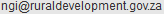

# gmza11: Global Map South Africa 1.1
## non-commercial use

## commercial use
  

## note
Credit: "Global Map of the Republic of South Africa © ISCGM/State Copyright, Department of Rural Development and Land Reform, Chief Directorate of National Geo-spatial Information, Website: http://www.ngi.gov.za/"

Contact: Department of Rural Development and Land Reform, Chief Directorate of National Geo-spatial Information. 

E-mail: 

URL: http://www.ngi.gov.za/

## metadata
Global Map South_Africa 1.1: Land Cover 1.1

This Data is for Global Map phase 2.2
 The classification is different from the Global Map Specifications 1.2.1.

### Tentative land cover legend for Global Map phase 2
1.  Broadleaf Evergreen Forest		
2.  Broadleaf Deciduous Forest		
3.  Needleleaf Evergreen Forest		
4.  Needleleaf Deciduous Forest		
5.  Mixed Forest				
6.  Tree Open				
7.  Shrub				
8.  Herbaceous, single layer			
9.  Herbaceous with Sparse Tree/Shrub	
10.  Sparse Herbaceous / Shrub		
11.  Cropland (herbaceous crops except rice)	
12.  Rice, paddy				
13.  Cropland / Natural Vegetation Mosaic	
14.  Tree-Water (Brackish to Saline)		
15.  Wetland				
16.  Bare area, consolidated (gravel, rock)	
17.  Bare area, unconsolidated (sand)		
18.  Urban				
19.  Snow / Ice				
20.  Water bodies

(From the Report of the International Steering Committee for Global Mapping (ISCGM) Working Group 4 on Raster Data Development" submitted to ISCGM13 meeting.)
	       
